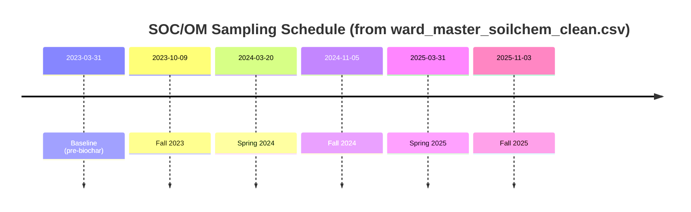

# Soil Organic Carbon and Organic Matter Dynamics by Strip, 2023–2025

## Executive summary

The attached dataset reports **soil organic matter by loss-on-ignition (LOI)** as a percent (`organic_matter_loi_pct`) at **six sampling events** from **2023-03-31** (baseline) through **2025-11-03** for all four strips. Because the file’s key variable is explicitly labeled **“organic_matter_loi_pct”**, this analysis treats the measurements as **% organic matter (OM) by LOI**, not direct **% soil organic carbon (SOC)** unless otherwise documented.

Across **all strips**, OM values are low (≈1.6–2.6% OM), and **all strips increased modestly over time** from baseline to Fall 2025 by roughly **+0.2 to +0.3 OM percentage points** (≈+9% to +17% relative to each strip’s baseline). The **biochar strips (strip_1, strip_3)** do **not** show a clear, immediate post‑application OM increase relative to controls; instead the “difference‑in‑differences” (biochar minus control change since baseline) is **negative in Fall 2023**, mixed/near‑zero in 2024, and **modestly positive in Spring 2025**, then small again by Fall 2025.

Exploratory paired tests at each date are **not statistically informative** because there are only **two paired replicates per date** (west pair and east pair). Most of what we can say from this dataset is therefore **descriptive**: relative SOC/OM changes appear **small** at this sampling intensity, and **controls also increase**, so attribution to biochar using LOI OM alone is limited.

Methodologically, LOI strongly depends on protocol; entity["organization","Ward Laboratories","soil testing lab, kearney ne us"] describes drying at 105 °C and ignition at 360 °C with OM computed from mass loss. citeturn0search0 LOI protocols are known to vary and can be influenced by ignition conditions and mineral structural water effects. citeturn1search9 If your intent is specifically **biochar-added carbon**, a single-temperature LOI OM measure may not cleanly isolate that pool; specialized approaches (e.g., two-temperature LOI methods for estimating biochar content) exist. citeturn1search19

## Data provenance and standardization

The analysis uses the uploaded **`ward_master_soilchem_clean.csv`** with:
- **Strip IDs** standardized from `sample_id` (“STRIP 1” … “STRIP 4”) to `strip_1` … `strip_4`.
- **Dates** parsed from `date_rec` and treated as sampling dates.
- The OM variable is `organic_matter_loi_pct`, treated as **OM% (LOI)**.

**Treatment labeling used here (per your experimental design context):**
- Biochar: `strip_1`, `strip_3`
- Control: `strip_2`, `strip_4`
- Paired structure: West pair = (strip_1 − strip_2); East pair = (strip_3 − strip_4)

Sampling schedule extracted from the dataset:



## Measurement interpretation: LOI organic matter vs SOC

### What the dataset directly supports

The dataset directly supports analysis of **OM by LOI (%)**. entity["organization","Ward Laboratories","soil testing lab, kearney ne us"] documents OM(LOI) as **mass loss** after drying and ignition (105 °C dry, then 360 °C ignition) with OM computed from weight difference. citeturn0search0 A similar protocol is described by entity["organization","UC Davis Analytical Lab","university of california davis, us"] for OM‑LOI and notes that OM‑LOI is a gravimetric estimate of oxidizable organic matter. citeturn0search10

### Converting OM% to an SOC% estimate when needed

If the values are **OM%** (not direct SOC%), one common approximate conversion is:

\[
SOC\_\% \approx OM\_\% \times 0.58
\]

This “0.58” assumption (organic matter ~58% carbon) is widely used in soil health educational materials and lab method notes. citeturn0search3turn0search10

**Important caveat:** the OM↔SOC ratio is **not universal**; it varies by soil type, depth, and organic matter composition. Peer‑reviewed work and technical reports show that using a fixed 0.58 can introduce bias in some contexts. citeturn0search15turn0search5 Because the conversion is linear, the **time patterns** shown below are identical whether you view OM% directly or SOC% estimated by 0.58; only the **y‑axis scale** changes.

## Results: strip trajectories and pairwise treatment contrasts

### Strip-by-strip changes over time

From baseline (2023‑03‑31) to the latest sampling (2025‑11‑03), all strips increased modestly:

| Strip | Biochar? | Baseline OM% | Latest OM% | Net change (OM points) | Net % change | Peak OM% (date) |
|---|---|---:|---:|---:|---:|---:|
| strip_1 | yes | 2.2 | 2.4 | +0.2 | +9.1% | 2.6 (2025‑03‑31) |
| strip_2 | no  | 1.9 | 2.1 | +0.2 | +10.5% | 2.1 (2025‑03‑31) |
| strip_3 | yes | 1.8 | 2.1 | +0.3 | +16.7% | 2.3 (2024‑03‑20) |
| strip_4 | no  | 1.6 | 1.8 | +0.2 | +12.5% | 2.0 (2024‑03‑20) |

A key interpretive point is that **baseline OM differed across strips** (strip_1 > strip_2; strip_3 > strip_4). That is why the next view—**change from baseline** and **difference‑in‑differences**—is more relevant than raw OM differences.

### Visualizations

**Organic matter (LOI) by strip over time**  


**Change from baseline (2023-03-31) by strip**  


**Pairwise “treatment effect” (difference‑in‑differences)**  
This plot shows, for each pair, how the **biochar–control gap changed relative to baseline**, i.e.  
\[
(\Delta OM\_{biochar}) - (\Delta OM\_{control})
\]


**What these figures support (descriptively):**
- **Fall 2023:** both pairs show the biochar strip’s OM change lagging control (≈ −0.2 OM points vs baseline in each pair).
- **2024:** mixed/near‑zero net pair effect.
- **Spring 2025:** modest positive difference‑in‑differences (west ≈ +0.2; east ≈ +0.1 OM points).
- **Fall 2025:** west returns near 0; east remains ≈ +0.1.

### Pairwise contrasts (raw and baseline-adjusted)

For transparency, here are the pairwise contrasts as OM percentage points:

| Date | Pair | Raw difference (biochar − control) | Change in that difference vs baseline |
|---|---|---:|---:|
| 2023-03-31 | west | +0.3 | 0.0 |
| 2023-03-31 | east | +0.2 | 0.0 |
| 2023-10-09 | west | +0.1 | −0.2 |
| 2023-10-09 | east | 0.0 | −0.2 |
| 2024-03-20 | west | +0.2 | −0.1 |
| 2024-03-20 | east | +0.3 | +0.1 |
| 2024-11-05 | west | +0.3 | ~0.0 |
| 2024-11-05 | east | +0.1 | −0.1 |
| 2025-03-31 | west | +0.5 | +0.2 |
| 2025-03-31 | east | +0.3 | +0.1 |
| 2025-11-03 | west | +0.3 | ~0.0 |
| 2025-11-03 | east | +0.3 | +0.1 |

## Statistical checks and uncertainty

### Per-date paired tests (exploratory only)

At each date, there are only **two paired replicates** (west and east). A paired t‑test or Wilcoxon test with **n=2** has extremely low power and unstable assumptions. The results below should be interpreted as **diagnostic checks**, not evidence of significance.

| Date | Pair diffs (S1−S2, S3−S4) | Mean diff | Paired t p‑value | Wilcoxon p‑value |
|---|---|---:|---:|---:|
| 2023-03-31 | [0.3, 0.2] | 0.25 | 0.126 | 0.50 |
| 2023-10-09 | [0.1, 0.0] | 0.05 | 0.500 | 1.00 |
| 2024-03-20 | [0.2, 0.3] | 0.25 | 0.126 | 0.50 |
| 2024-11-05 | [0.3, 0.1] | 0.20 | 0.295 | 0.50 |
| 2025-03-31 | [0.5, 0.3] | 0.40 | 0.156 | 0.50 |
| 2025-11-03 | [0.3, 0.3] | 0.30 | NA (zero variance) | 0.50 |

Downloadable file with these results:  
[soc_pairwise_tests_by_date.csv](sandbox:/mnt/data/soc_pairwise_tests_by_date.csv)

### Method uncertainty relevant to biochar

Two uncertainties matter for interpretation:

First, **LOI protocol differences** (temperature, duration, soil mineralogy) can change OM inference; LOI lacks a universal standard and can be influenced by structural water loss and other non‑OM mass changes. citeturn1search9turn0search2

Second, the **OM→SOC conversion factor (0.58)** is a convenience and may not match your soil’s true carbon fraction of OM; published work shows substantial variation in C:OM ratios depending on context. citeturn0search15turn0search5

## Interpretation in the context of biochar impacts

If biochar added substantial, well‑mixed carbon to the sampled depth, you might expect a clearer, step‑like increase in SOC/OM in biochar strips after application. In this dataset, that pattern is **not strongly expressed** in LOI OM: early post‑baseline differences do not favor biochar, and later (2025) positive differences are **modest** and not consistently sustained.

There are several plausible, non‑exclusive explanations consistent with the measurement literature:

LOI OM is a **bulk proxy** and is sensitive to protocol and soil properties; modest OM shifts (0.1–0.3 points) can reflect a combination of management, residue inputs, sampling variability, and lab method effects rather than a single treatment. citeturn1search9turn0search2

Biochar carbon is not identical to fresh organic matter; some approaches explicitly develop methods to quantify biochar content in soils using adaptations of LOI (e.g., multi‑temperature LOI), implying that single‑temperature LOI may not always isolate the biochar pool cleanly. citeturn1search19

In your broader project notes, microbial biomass and system behavior respond strongly to biochar even when plant P remains stable and K shows a clearer signal—suggesting that biochar effects can be mediated through habitat/structure and biological buffering, not necessarily large detectable changes in bulk OM at low sampling intensity. fileciteturn0file0

## Deliverables and prioritized sources

**Deliverables generated from your attached CSV**
- Master table (OM and SOC‑estimated): [soc_master_table_om_and_soc_est.csv](sandbox:/mnt/data/soc_master_table_om_and_soc_est.csv)
- Plots embedded above (PNG)
- Per-date exploratory paired tests: [soc_pairwise_tests_by_date.csv](sandbox:/mnt/data/soc_pairwise_tests_by_date.csv)

**Master table (CSV-style)**  
(Full 24-row table; also downloadable via the link above.)

```csv
date,strip,biochar_yesno,pair,om_pct,om_delta_from_baseline,om_pct_change_from_baseline,soc_est_pct,soc_est_delta_from_baseline,soc_est_pct_change_from_baseline,pair_diff_om_pct_points,pair_diff_pct_of_control,pair_diff_delta_om_pct_points,pair_diff_delta_pct_of_control_baseline
2023-03-31,strip_1,yes,west,2.2,0.0,0.0,1.276,0.0,0.0,0.30000000000000027,15.789473684210542,0.0,0.0
2023-03-31,strip_2,no,west,1.9,0.0,0.0,1.1019999999999999,0.0,0.0,0.30000000000000027,15.789473684210542,0.0,0.0
2023-03-31,strip_3,yes,east,1.8,0.0,0.0,1.044,0.0,0.0,0.19999999999999996,12.5,0.0,0.0
2023-03-31,strip_4,no,east,1.6,0.0,0.0,0.928,0.0,0.0,0.19999999999999996,12.5,0.0,0.0
2023-10-09,strip_1,yes,west,2.1,-0.10000000000000009,-4.545454545454549,1.218,-0.05800000000000005,-4.545454545454549,0.10000000000000009,5.000000000000004,-0.20000000000000018,-10.526315789473694
2023-10-09,strip_2,no,west,2.0,0.10000000000000009,5.263157894736847,1.16,0.05800000000000005,5.263157894736847,0.10000000000000009,5.000000000000004,-0.20000000000000018,-10.526315789473694
2023-10-09,strip_3,yes,east,1.6,-0.19999999999999996,-11.111111111111109,0.928,-0.11599999999999996,-11.111111111111109,0.0,0.0,-0.19999999999999996,-12.499999999999996
2023-10-09,strip_4,no,east,1.6,0.0,0.0,0.928,0.0,0.0,0.0,0.0,-0.19999999999999996,-12.499999999999996
2024-03-20,strip_1,yes,west,2.2,0.0,0.0,1.276,0.0,0.0,0.20000000000000018,10.000000000000009,-0.10000000000000009,-5.263157894736847
2024-03-20,strip_2,no,west,2.0,0.10000000000000009,5.263157894736847,1.16,0.05800000000000005,5.263157894736847,0.20000000000000018,10.000000000000009,-0.10000000000000009,-5.263157894736847
2024-03-20,strip_3,yes,east,2.3,0.4999999999999998,27.777777777777764,1.334,0.28999999999999987,27.777777777777764,0.2999999999999998,14.999999999999991,0.09999999999999987,6.249999999999992
2024-03-20,strip_4,no,east,2.0,0.3999999999999999,24.999999999999993,1.16,0.23199999999999993,24.999999999999993,0.2999999999999998,14.999999999999991,0.09999999999999987,6.249999999999992
2024-11-05,strip_1,yes,west,2.3,0.09999999999999964,4.5454545454545295,1.334,0.05799999999999979,4.5454545454545295,0.2999999999999998,14.999999999999991,-4.440892098500626e-16,-2.3373116307898032e-14
2024-11-05,strip_2,no,west,2.0,0.10000000000000009,5.263157894736847,1.16,0.05800000000000005,5.263157894736847,0.2999999999999998,14.999999999999991,-4.440892098500626e-16,-2.3373116307898032e-14
2024-11-05,strip_3,yes,east,1.8,0.0,0.0,1.044,0.0,0.0,0.10000000000000009,5.882352941176475,-0.09999999999999987,-6.249999999999992
2024-11-05,strip_4,no,east,1.7,0.09999999999999987,6.249999999999992,0.986,0.05799999999999992,6.249999999999992,0.10000000000000009,5.882352941176475,-0.09999999999999987,-6.249999999999992
2025-03-31,strip_1,yes,west,2.6,0.3999999999999999,18.181818181818176,1.508,0.23199999999999993,18.181818181818176,0.5,23.809523809523807,0.19999999999999973,10.52631578947367
2025-03-31,strip_2,no,west,2.1,0.20000000000000018,10.526315789473694,1.218,0.1160000000000001,10.526315789473694,0.5,23.809523809523807,0.19999999999999973,10.52631578947367
2025-03-31,strip_3,yes,east,2.1,0.30000000000000004,16.66666666666667,1.218,0.17400000000000004,16.66666666666667,0.30000000000000004,16.666666666666668,0.10000000000000009,6.250000000000006
2025-03-31,strip_4,no,east,1.8,0.19999999999999996,12.499999999999996,1.044,0.11599999999999998,12.499999999999996,0.30000000000000004,16.666666666666668,0.10000000000000009,6.250000000000006
2025-11-03,strip_1,yes,west,2.4,0.19999999999999973,9.090909090909078,1.392,0.11599999999999984,9.090909090909078,0.2999999999999998,14.285714285714275,-4.440892098500626e-16,-2.3373116307898032e-14
2025-11-03,strip_2,no,west,2.1,0.20000000000000018,10.526315789473694,1.218,0.1160000000000001,10.526315789473694,0.2999999999999998,14.285714285714275,-4.440892098500626e-16,-2.3373116307898032e-14
2025-11-03,strip_3,yes,east,2.1,0.30000000000000004,16.66666666666667,1.218,0.17400000000000004,16.66666666666667,0.30000000000000004,16.666666666666668,0.10000000000000009,6.250000000000006
2025-11-03,strip_4,no,east,1.8,0.19999999999999996,12.499999999999996,1.044,0.11599999999999998,12.499999999999996,0.30000000000000004,16.666666666666668,0.10000000000000009,6.250000000000006
```

**Prioritized sources used in this report**
Primary evidence is the uploaded `ward_master_soilchem_clean.csv` and the LOI OM column therein. For method context and conversion assumptions, I prioritized primary lab/protocol descriptions and technical references: Ward’s soil test method description for OM‑LOI citeturn0search0, NRCS educator material describing SOM↔SOC using 0.58 citeturn0search3, and a lab method note describing OM‑LOI at 360 °C and the 58% carbon assumption citeturn0search10. For uncertainty and limitations, I used peer‑review/technical sources documenting LOI protocol sensitivity and lack of universal standardization citeturn1search9turn0search2 and evidence that C:OM ratios vary so 0.58 can be biased citeturn0search15turn0search5. To contextualize biochar quantification challenges under LOI, I referenced a two‑temperature LOI approach developed for estimating biochar content in field soils. citeturn1search19 A related internal project note is also available. fileciteturn0file1