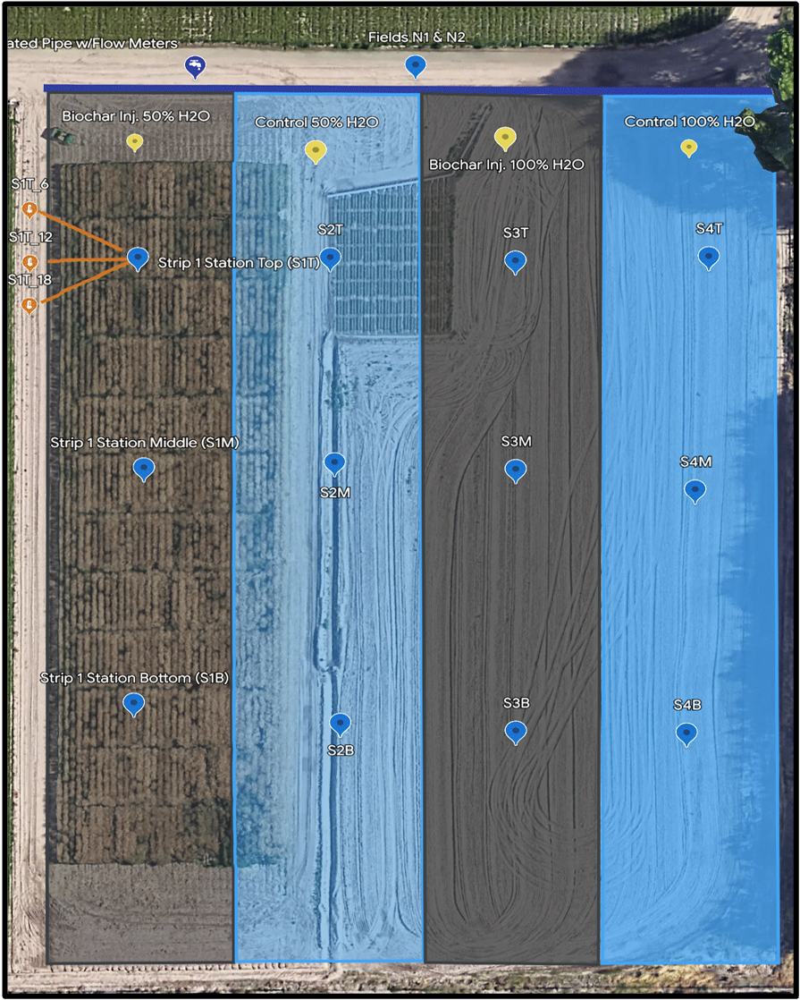
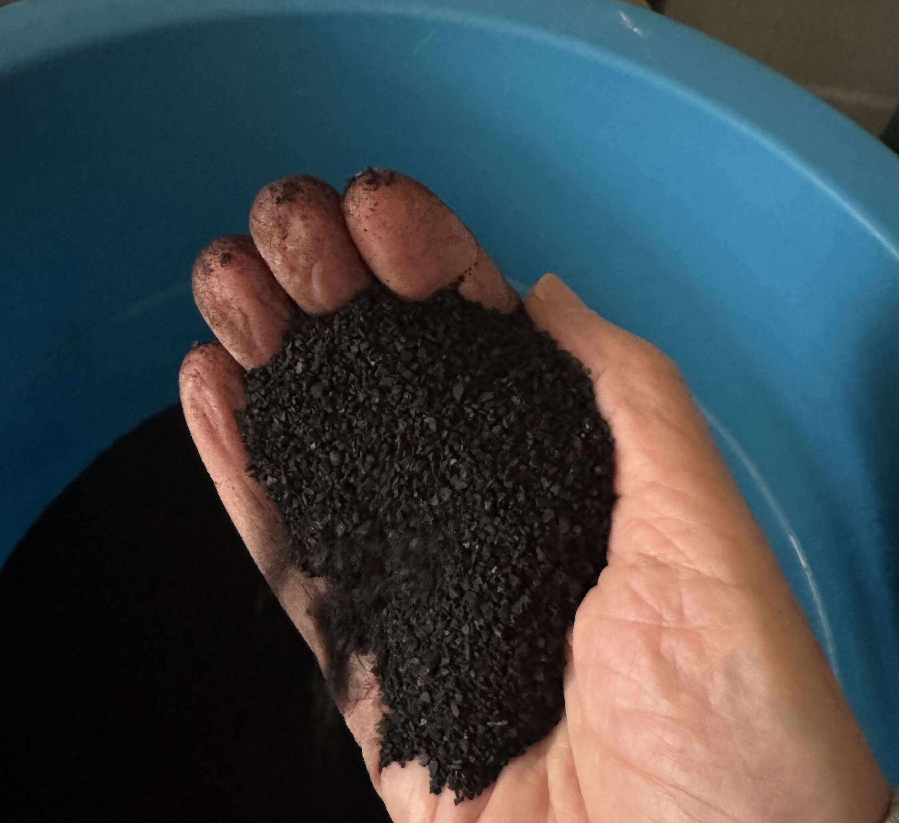

## The Biochar Experiment

The experiment is underway at the Fruita Research Station of Colorado
State University. It began in Spring 2023.

The image below shows the layout of the experimental field. It was an
unused pasture experiment plot when we first started. There are four
strips, numbered 1 to 4 from left (west) to right (east). Each strip is
about 46 ft wide and 280 ft long.

-   Strips 1 and 3 had biochar injected every 6 inches to an approximate
    depth of 6 inches.
-   Strips 2 and 4 had no biochar amendment.

Irrigation for the field is done using furrow irrigation, with the
furrows 30 inches apart. Irrigation water is applied at the north end
(top of the image) and runs down the furrows, infiltrating into the soil
until it is saturated. Any excess runs into a drainage ditch at the
south end of the field.

Irrigation is applied to the east two rows (strips 3 and 4) roughly every two weeks during the growing season. The west two strips are irrigated only once a month.

<figure>

<figcaption aria-hidden="true">Experimental Layout</figcaption>
</figure>

### Biochar source and application

The biochar used in this experiment is made from pistachio shells and
was purchased from [VGrid Energy Systems](https://vgridenergy.com),
Camarillo, California. More details and chemical analysis results are
available in the Additional Information tab.

<figure>

<figcaption aria-hidden="true">Pistacchio shell biochar</figcaption>
</figure>

The process to collect soil moisture, electrical conductivity, and
temperature is described in detail in the Technical Details tab.

  
### Soil sampling

Soil samples for each strip were collected in early spring and late fall
and analyzed by [Ward Labs](https://www.wardlab.com/) in Kearney,
Nebraska.

### Fertilizer application

The Ward Labs fertilizer recommendations based on the soil samples for
each strip were followed.

### Yield quality and quantity measurements

Some text here.
