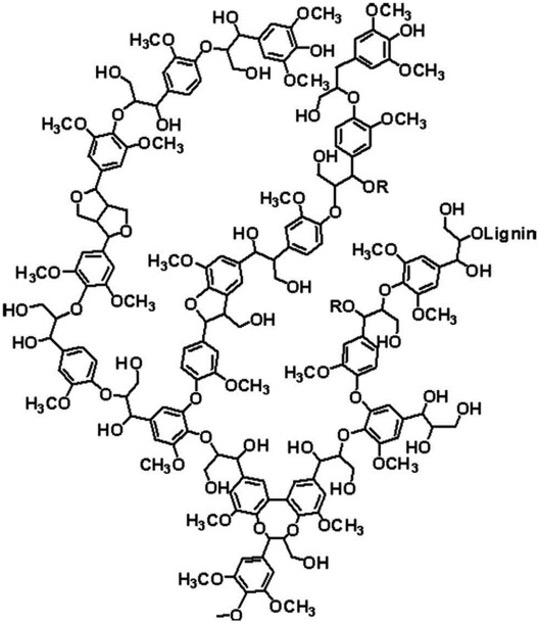

# Welcome to the Fruita Biochar Project

\[Note: This is an early version of this website. Expect problems. If
you find one or just have a suggestion for improvements, please email
*nelson.gerald.c@gmail.com*.\]

This is an introduction to the project. Here’s what you can expect:

-   An introduction to what biochar is and why it is potentially
    valuable in western Colorado (and other drought prone areas of the
    world).
-   Overview of the biochar experiment at the Colorado State University
    research station outside Fruita, CO.
-   Digital data collection results in graphical (Main Data Display tab)
    and tabular form (Summary Statistics tab)
-   Technical details on the data collection process.
-   Coming soon, biochar source and characteristics, fertilizer
    application, soil results and yield quantity and quality

## What is Biochar?

Biochar is the solid material obtained from the thermochemical
conversion of biomass in an oxygen-limited environment (International
Biochar Initiative).

-   **Surface area:** ~2,000 ft²/gram (half a basketball court!)
-   **Water Holding Capacity:** Up to ~7 times its weight in water.

<figure>

<figcaption aria-hidden="true">Scanning electron microscope image of biochar</figcaption>
</figure>

For those interested in the chemistry, a bit of biological history is in
order. In plant-based biochar, a key element of vascular plants is the
carbohydrate *lignin*. It provides the support structure for plants,
allowing them to adapt to life on land. A diagram of the chemical
formula for lignan is below, left. On the right is a similar diagram for a well-processed biochar. Note that the components that make lignin a carbohydrate almost gone. The remaining hexgonal structures are carbon (benzine) rings. A key point is that microbes have evolved to break down carbohydrates but not carbon rings. This is why biochar remains in the soil for 100s to 1000s of years.

<figure>

<figcaption aria-hidden="true">Lignan chemical structure</figcaption>
</figure>

<figure>

<figcaption aria-hidden="true">Biochar chemical structure</figcaption>
</figure>

## Image sources for the chemical structure diagrams
- https://www.sciencedirect.com/topics/materials-science/lignin and
https://www.envchemgroup.com/nanostructures-biochar.html

